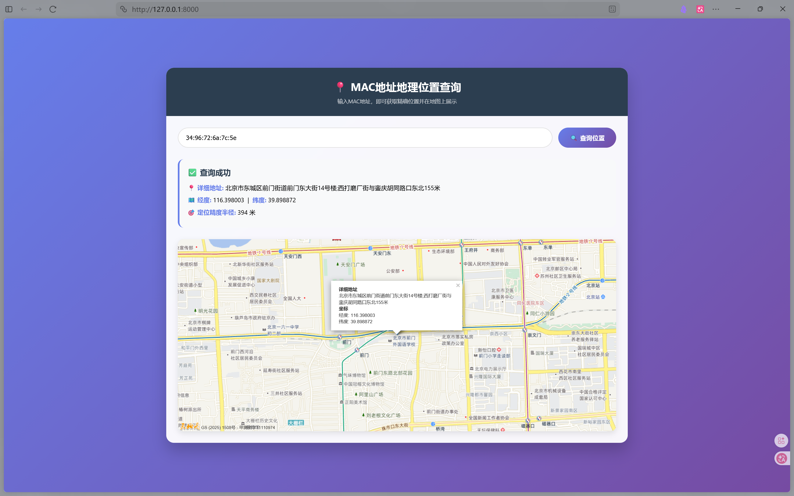
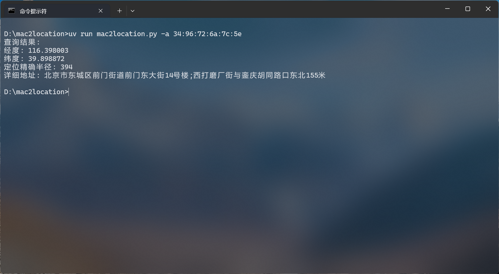

# MAC 地址地理位置查询工具

通过 MAC 地址查询对应的经纬度坐标和实际地理位置。

## 功能特性

- 🔍 支持 MAC 地址地理位置查询
- 💻 提供 CLI 命令行工具
- 🌐 提供 Web 界面，支持地图可视化
- 📍 返回经纬度、详细地址、定位精度等信息

效果预览：



## 技术栈

- Python 3.14+
- FastAPI
- Click
- Jinja2
- 天地图 API

## 安装

使用 [uv](https://github.com/astral-sh/uv) 安装依赖：

```bash
uv sync
```

## 使用方式

### 方式一：命令行工具

```bash
python mac2location.py -a <MAC地址>
```

示例：

```bash
python mac2location.py -a 34:96:72:6a:7c:5e
```

### 方式二：Web 服务

启动服务：

```bash
python main.py
```

或使用 uvicorn：

```bash
uvicorn main:app --host 0.0.0.0 --port 8000
```

访问 http://localhost:8000 即可使用 Web 界面进行查询。

#### 天地图 API 申请配置

Web 服务使用天地图 API 进行地图展示，首次使用需要申请 API Key。

#### 申请步骤

1. **注册账号**

   访问 [天地图官网](https://www.tianditu.gov.cn/)，点击右上角"注册"。
   
   > 注意：请在全国天地图官网注册，不要在各省分站注册，数据不同步。

2. **申请成为开发者**

   登录后，点击首页菜单的"开发资源" → 进入"控制台" → 选择"申请成为个人开发者"，填写资料后提交。

3. **创建应用获取 Key**

   在控制台左侧菜单找到"我的应用" → 点击"创建新应用"：
   
   | 字段 | 填写说明 |
   |------|----------|
   | 应用名称 | 自定义，如 "MAC地址查询" |
   | 行业类别 | 根据实际情况选择 |
   | 应用类型 | 选择 **浏览器端** |
   | IP白名单 | 可留空 |

   创建成功后，页面显示的 Key 即为 API 密钥。

#### 配置 Key

将获取的 Key 填入 `main.py` 中的 `TIANDITU_KEY` 变量：

```python
TIANDITU_KEY = "your_api_key_here"
```

## API 接口

### 查询 MAC 地址位置

**请求**

```
POST /query
Content-Type: application/x-www-form-urlencoded

mac=<MAC地址>
```

**响应**

```json
{
  "success": true,
  "lon": 116.398003,
  "lat": 39.898872,
  "radius": 394,
  "address": "北京市东城区前门街道前门东大街14号楼;西打磨厂街与銮庆胡同路口东北155米"
}
```

## 数据来源

位置数据来自第三方 WiFi 位置服务 API (api.cellocation.com)。

## License

MIT